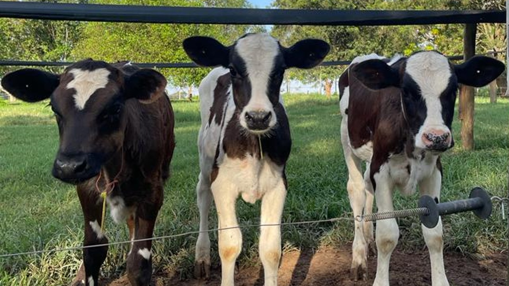

# Meta-Analysis: Effects of Early Group Housing on Dairy Calves

  

## Introduction

This repository contains data, scripts, and supplementary materials for the meta-analysis:  
**"A meta-analysis approach to evaluate the effects of early group housing on calf performance, health, and behavior during the preweaning period"**  
Published in *Journal of Dairy Science* (2025). [DOI: 10.3168/jds.2024-25159](https://doi.org/10.3168/jds.2024-25159)

---

## 📋 Study Overview

### Background
Dairy calves are traditionally separated from dams shortly after birth and raised individually during the preweaning period. While this practice is common, it contrasts with natural social dynamics and raises welfare concerns. Social isolation can lead to stress, fearfulness, and reduced cognitive development. Group housing (pairs or small groups) has emerged as a potential alternative, but its effects on performance, health, and behavior remain inconsistently reported across studies. This meta-analysis synthesizes evidence from 51 articles (85 studies) to evaluate the impact of early group housing on dairy calves.

### Key Findings
- **Performance**:  
  🟢 Group-housed calves had **higher average daily gain (ADG)** (+0.06 kg/d, *P* = 0.001) and **weaning weight** (+1.44 kg, *P* = 0.037).  
  🟢 Increased **concentrate intake** in group housing (*P* = 0.021).  
- **Behavior**:  
  🟢 More **active behaviors** (feeding, playing) and fewer **stress-related behaviors** (self-grooming, pen interactions) in group-housed calves.  
  🟢 Group-housed calves vocalized more in novel environments but interacted less with humans.  
- **Health**:  
  ➖ No significant differences in blood parameters (e.g., glucose, TNF-α).  
  ⚠️ Limited data on robust health outcomes (e.g., disease incidence).  

---

## 📂 Repository Structure
├── data/

├── scripts/

├── figures/

├── manuscript/

├── README.md

└── LICENSE

## 🛠️ Skills & Tools
1. **Data**: Raw data from 51 included studies is in `data/meta_analysis_data.xlsx`.
2. **Scripts**:
   - Run `meta_analysis.R` to reproduce Tables 2-4 and Figures 2-4.
   - Use `forest_plots.R` for visualization (STATA scripts provided for compatibility).
3. **Tools**:        

### Research Team

| Name (Abbreviation)       | Affiliation                                                                 | Contributions                                                                 |
|---------------------------|-----------------------------------------------------------------------------|-------------------------------------------------------------------------------|
| **João Pedro Donadio** (J.P. Donadio) | Dairy Cattle Study Group, FMVZ, Unesp Botucatu and Animal Science Program, Unesp Botucatu | • Conception and design of the study  • Acquisition, analysis, and interpretation of data  • Original draft preparation.  • CAPES grant |
| **Karolini Tenffen De-Sousa** (K.T. De-Sousa) |  Dairy Cattle Study Group, FMVZ, Unesp Botucatu and Instituto de Zootecnia | • Conception and design of the study • Revising the manuscript critically for important intellectual content |
| **Rodrigo de Nazaré Santos Torres** (R.N.S. Torres) | Dairy Cattle Study Group, FMVZ, Unesp Botucatu | • Analysis and interpretation of data  • Revising the manuscript critically for important intellectual content. |
| **Teresa Cristina Alves** (T.C. Alves) | Embrapa Pecuária Sudeste | • Revising the manuscript critically for important intellectual content |
| **Maria José Hötzel** (M.J. Hötzel) | Laboratório de Etologia Aplicada e Bem-estar Animal, UFSC | • Study design • Critical manuscript revision • CNPq grant PI (#304968/2019-6) |
| **Matheus Deniz*** (M. Deniz) | Dairy Cattle Study Group, FMVZ, Unesp Botucatu | • Study design • Data analysis/interpretation • Manuscript revision • Corresponding author |
| **Correspondence**: | m.deniz@unesp.br              | 📞 +55 (14) 3880-2954  |

"Note: The original analysis was conducted by R.N.S. Torres (as published). The current version was independently replicated by J.P. Donadio as a learning exercise."
